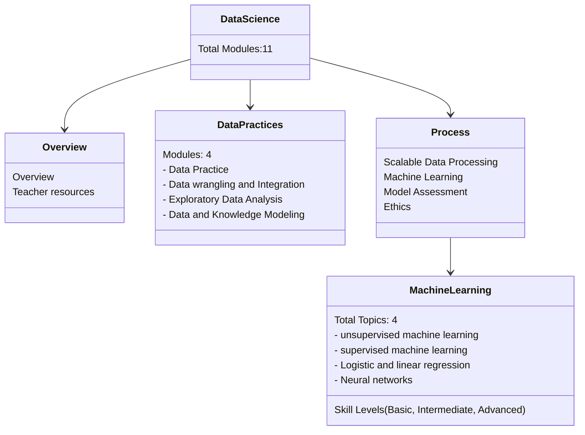

```mermaid
classDiagram
   DataScience --> Overview
   DataScience --> Data Practices
   DataScience --> Process
   Process --> Machine Learning
 
class  DataScience{
  Total Modules:11
    }
 
   class Overview{
   Overview
   Teacher resources
    }
 
   class  Data Practices{
  Modules: 4
   - Data Practice
   - Data wrangling and Integration
   - Exploratory Data Analysis
   - Data and Knowledge Modeling
   }
 
   class Machine Learning{
    Total Topics: 4
    - unsupervised machine learning
    - supervised machine learning
    - Logistic and linear regression
    - Neural networks
    Skill Levels(Basic, Intermediate, Advanced)
   
    }
class  Process{
   Scalable Data Processing
   Machine Learning
   Model Assessment
   Ethics
}


    
```

    
  
