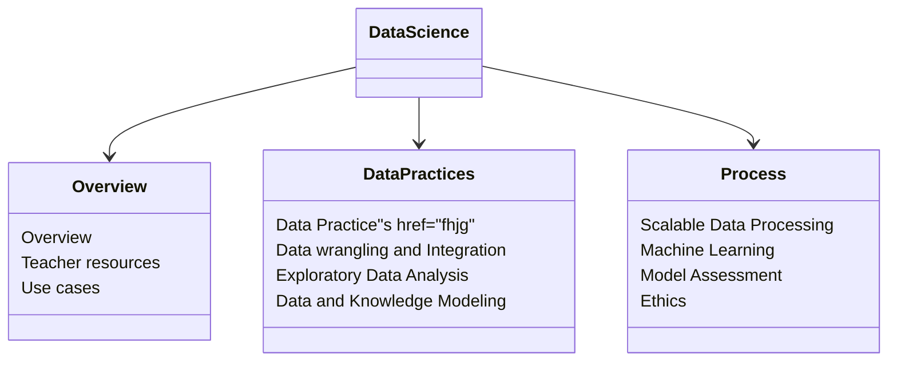
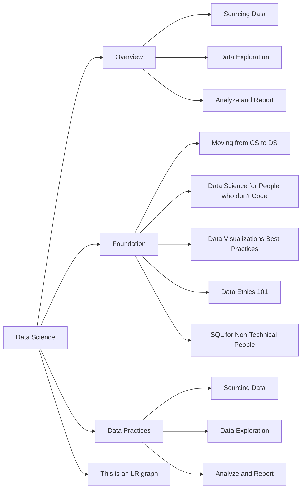
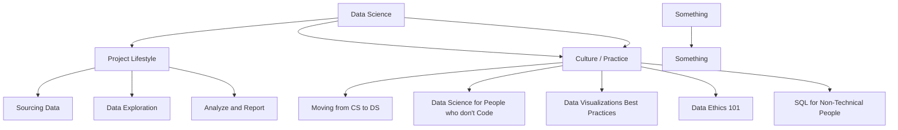

```mermaid
classDiagram
    DataScience --> Overview
    DataScience --> Data Practices
    DataScience --> Process

    class Overview{
    Overview
    Teacher resources
    Use cases
    }

    class  Data Practices{
    Data Practice"s href="fhjg"
    Data wrangling and Integration
    Exploratory Data Analysis
    Data and Knowledge Modeling
    }
class  Process{
    Scalable Data Processing
    Machine Learning
    Model Assessment
    Ethics
}
    
```

```mermaid
graph LR;
    A[Data Science]-->B[Overview];
    A[Data Science]-->C[Foundation];
    A[Data Science]-->D[Data Practices];
    A[Data Science]-->E[This is an LR graph];
    
    B-->1[Sourcing Data];
    B-->2[Data Exploration];
    B-->3[Analyze and Report];
   
    C-->1A[Moving from CS to DS];
    C-->1B[Data Science for People who don't Code];
    C-->1C[Data Visualizations Best Practices];
    C-->1D[Data Ethics 101];
    C-->1E[SQL for Non-Technical People];
    
    D-->1g[Sourcing Data];
    D-->2g[Data Exploration];
    D-->3g[Analyze and Report];
```

```mermaid
graph TD;
    A[Data Science]-->B[Project Lifestyle];
    A[Data Science]-->C[Culture / Practice];
    A[Data Science]-->C[Culture / Practice];
    
    B-->1[Sourcing Data];
    B-->2[Data Exploration];
    B-->3[Analyze and Report];
    
    C-->1A[Moving from CS to DS];
    C-->1B[Data Science for People who don't Code];
    C-->1C[Data Visualizations Best Practices];
    C-->1D[Data Ethics 101];
    C-->1E[SQL for Non-Technical People];
    
    D[Something]-->1Q[Something];
    
```

%%{init: {'themeVariables': { 'fontSize': '20pt', 'fontFamily': 'Inter'}}}%%
